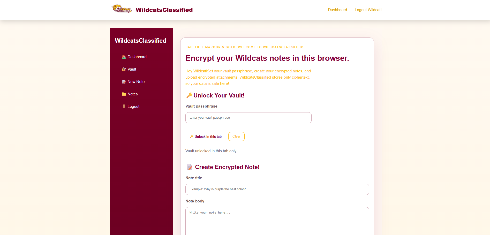
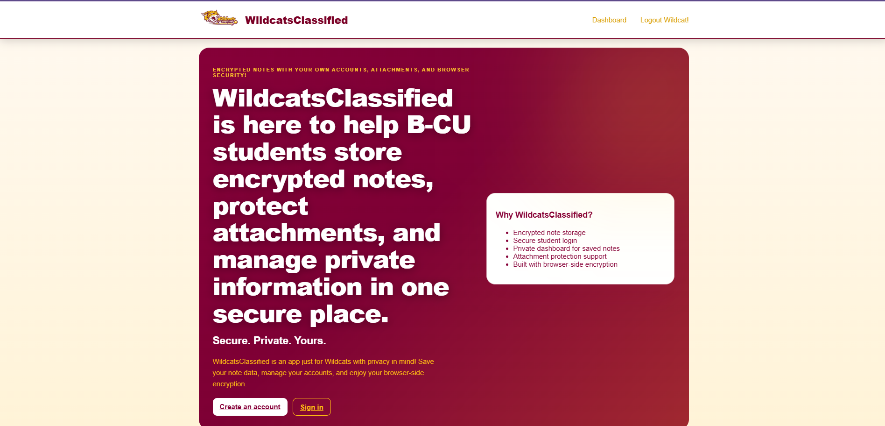

# Hi Everyone! This Is...WildcatsClassified! (with real browser-side encryption) curated by yours truly for Senior Design II!

This is my cybersecurity/full stack influenced project as I desire to further my education in Cybersecurity and pursue a future on the RedTeam!

This applicaiton explores secure data handling, full stack development, and a Wildcat focused interface!

## What Have I Implemented/Imported/Used
- Client-Side Encryption with WebCrypto
- Create and store your encrypted notes
- Upload encrypted attachments
- Log In with Secure Authentication with Flask Login
- A Personal Dashboard of your saved notes
- A Modernized UI with a sidebar for quick and easy navigation

## The Tech Stack I've Used
- **Frontend -** HTML5, CSS3, JavaScript  
- **Backend -** Flask (Python)  
- **Database -** SQLite (local version) / PostgreSQL (Supabase for the deployment)  
- **Authentication -** Flask-Login  
- **Encryption -** Web Crypto API  
- **Deployment -** Vercel  

## How The Site Works
- Notes are encrypted in the browser BEFORE being sent to the server
- The database ONLY stores ciphertext, not readable data
- Users decrypt their notes locally using their vault passphrase
- Attachments are encrypted BEFORE upload and decrypted on download

## Quick start for you if you want to run this locally on your laptop/computer:
```bash
git clone https://github.com/Oh-its-neisha242/wildcatsclassified.git
cd wildcatsclassified
```
## Then, install everything in the requirements file with:
```bash
py -m pip install -r requirements.txt
```
## Then run the app with 
```bash 
py run.py
```

Now open this in your browser! http://127.0.0.1:5000

## How to use!
1. Create an account. Log in (of course!)
2. On the dashboard, enter a vault passphrase and go ahead and click **Unlock in this tab**.
3. Create notes or upload attachments. The browser encrypts them before sending them to Flask.
4. Use the same passphrase to decrypt notes and attachments in the browser.

## The Easier to Use, Live Action Demo Can Be Found Here --> https://wildcatsclassified.onrender.com/

You will land on this page! 

Your dashboard will look like this-->


## Possible Future Updates?
- A Notes Filter
- Better On Mobile
- Update Already Encrypted Notes

## THEE Developer Herself 👩🏽‍💻
O'Neisha H Jones
Bethune-Cookman University - Pending B.S. In Computer Science
Aspiring Developer & Cybersecurity Professional!
Email: o.neisha.jones242@gmail.com 